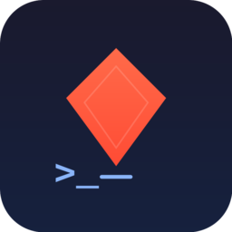

# Laravel Tinker (Unofficial)

<p align="center">
  
</p>

<p align="center">
  <video src="https://raw.githubusercontent.com/mdrbx/laravel-tinker-vscode/master/demo/example.mp4" controls muted width="800"></video>
</p>

<p align="center">
  <a href="https://marketplace.visualstudio.com/items?itemName=mdrbx.laravel-tinker-vscode"></a>
  <a href="https://github.com/mdrbx/laravel-tinker-vscode/releases"></a>
  <a href="https://github.com/mdrbx/laravel-tinker-vscode/blob/master/LICENSE"></a>
</p>

<p align="center">
  <strong>Run Laravel code directly in VS Code.</strong><br>
  Color-coded output, execution history, and first-class Docker/Sail support.
</p>

> Based on [laravel-runner](https://github.com/ali-raza-saleem/laravel-runner) by Ali Raza Saleem.

---

## Quick Start

```
1.  Ctrl + Shift + P  →  "Laravel Tinker: Install"
2.  Open .tinker/sample.php
3.  Ctrl + R  or  click ▶ in the editor title bar
```

That's it. Output appears in a side panel with syntax highlighting.

---

## Why this fork?

| Feature | laravel-runner | **This extension** |
|---|:---:|:---:|
| Color-coded output | Yes | Yes |
| Search & highlight | Yes | Yes |
| Stop execution | Yes | Yes |
| **Custom PHP runtime** (Sail, Docker) | — | Yes |
| **Execution history** (browse, restore) | — | Yes |
| **Play/Stop in editor title bar** | — | Yes |
| **Per-workspace history isolation** | — | Yes |

---

## Docker & Sail support

Works out of the box with any PHP runtime. Just set your command in settings:

```jsonc
// Laravel Sail
"laravelTinker.phpCommand": "sail php"

// Docker Compose
"laravelTinker.phpCommand": "docker-compose exec app php"

// Any custom command
"laravelTinker.phpCommand": "ssh server php"
```

The extension handles path mapping automatically — no extra configuration needed.

---

## Execution History

Every run is saved locally, scoped per workspace. Press <kbd>Ctrl</kbd> + <kbd>Alt</kbd> + <kbd>H</kbd> or click the clock icon to:

- Browse past executions with timestamps and duration
- Restore any previous output with one click
- View the script that produced each result
- Delete individual entries or clear all history

Configurable limits keep storage in check (default: 500 entries / 200 MB).

---

## Settings

All settings live under `laravelTinker.*` in VS Code.

| Setting | Default | Description |
|---|---|---|
| `phpCommand` | `php` | PHP command — `php`, `sail php`, `docker-compose exec app php`, etc. |
| `playgroundFolder` | `.tinker` | Folder where scripts are executed (relative to project root) |
| `appendOutput` | `true` | Keep output from previous runs visible |
| `historyEnabled` | `true` | Save executions to local history |
| `historyMaxEntries` | `500` | Maximum history entries to keep |
| `historyMaxSizeMb` | `200` | Maximum history storage in MB |

---

## Keyboard Shortcuts

| Shortcut | Action |
|---|---|
| <kbd>Ctrl</kbd> + <kbd>R</kbd> | Run PHP file |
| <kbd>Ctrl</kbd> + <kbd>Alt</kbd> + <kbd>H</kbd> | Show execution history |
| <kbd>Ctrl</kbd> + <kbd>Alt</kbd> + <kbd>C</kbd> | Clear output |
| <kbd>Ctrl</kbd> + <kbd>Alt</kbd> + <kbd>F</kbd> | Search output |

All shortcuts are customizable via VS Code keybindings.

---

## FAQ

**Will it touch my database?**
Only if your code tells it to. The extension just runs your PHP file through Laravel's bootstrapper.

**Does it work with Docker / Sail / remote containers?**
Yes. Set `laravelTinker.phpCommand` to your runtime command. Path mapping is handled automatically.

**Where is history stored?**
In VS Code's workspace storage directory, isolated per project. Nothing is added to your git repository.

**What platforms are supported?**
macOS, Linux, Windows, WSL, and remote SSH.

---

## Credits

Fork of [laravel-runner](https://github.com/ali-raza-saleem/laravel-runner) by [Ali Raza Saleem](https://github.com/ali-raza-saleem), with execution history, custom runtime support, and UI improvements.

## License

[MIT](LICENSE) — Original copyright Ali Raza Saleem, modifications by mdrbx.
